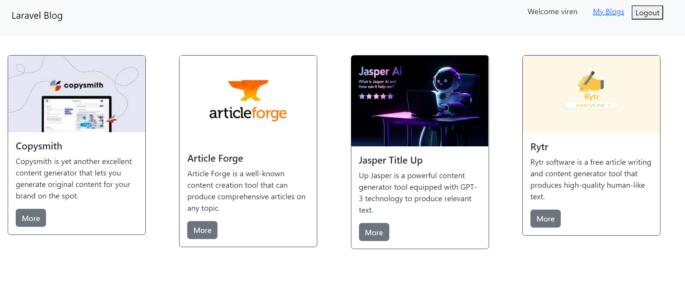
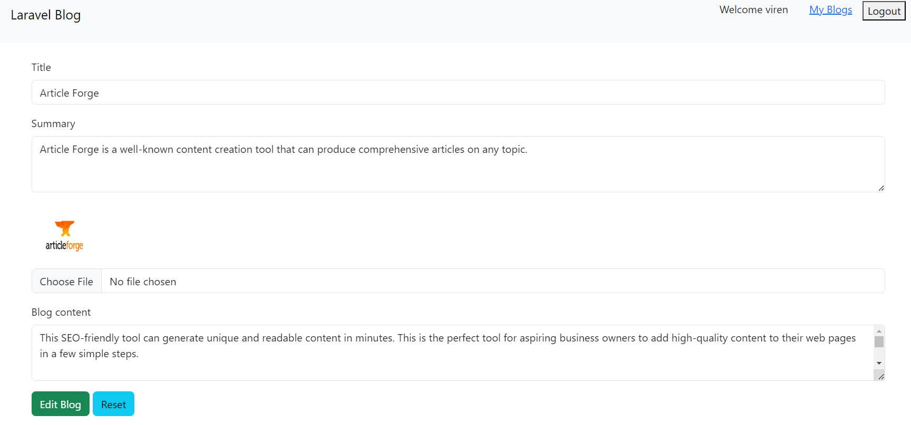
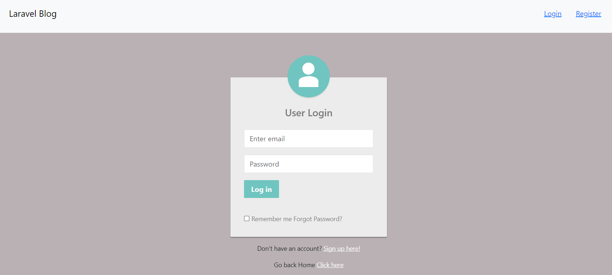
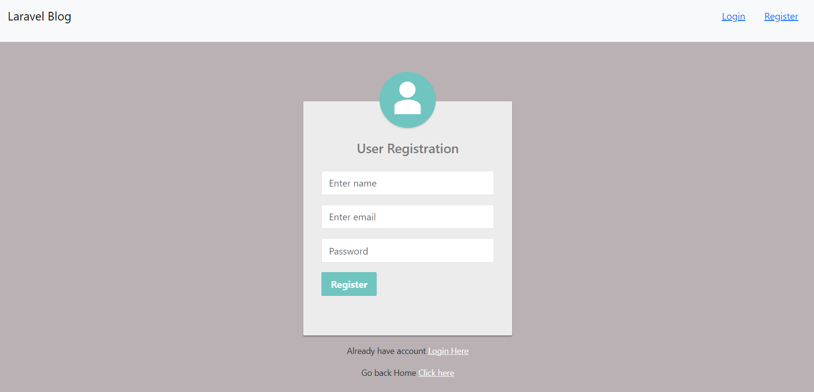

# Laravel Blog
Blog application with PHP Laravel and MySQL
## Requirement

- PHP Composer
- MySQL Database
- Xammp

## Running a Project

- Configure you DB in .env file follow .env.sample file
- Run Migration `php artisan migrate` (make sure that mysql is running)
- Run the project `php artisan serve`
- Navigate to localhost:8000

## Functionalities

- View Blog
- Create Blog
- Edit Blog
- Delete Blog
- User Login and Registration
- Authentication

## Images

|  | 
|:--:| 
| *Homepage* |

|  | 
|:--:| 
| *Edit Blog Page* |

|  | 
|:--:| 
| *Login Page* |

|  | 
|:--:| 
| *Registration Page* |